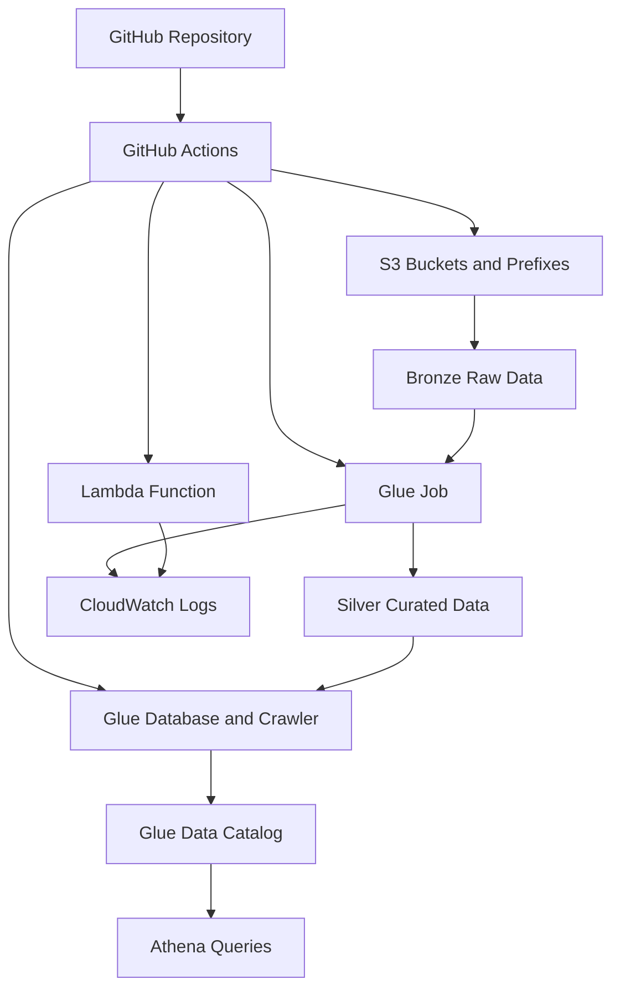

---

[Home](../README.md) | [Course Modules](../README.md#course-modules) | [Previous](../module-12-production-support-scenarios/118-production-support-best-practices.md) | [Next](120-capstone-solution-guide.md)

---

# Enterprise Data Platform Capstone

## Project Goal

Build a small enterprise-style AWS data platform that shows how data moves from raw files to curated analytics tables using the services and operational practices covered in this course.

The project should prove that a student can design, deploy, secure, monitor, and explain a real AWS data engineering platform.

---

## Business Scenario

You are a data engineer working for a healthcare company named `HealthData Corp`.

The company receives daily claim files from partner systems. Business users want a clean analytics table that can be queried using Athena.

Your job is to create an AWS data platform that:

* Stores raw claim files in S3
* Processes raw data into curated data
* Catalogs curated data for Athena
* Uses IAM roles instead of hardcoded credentials
* Uses GitHub Actions for deployment
* Provides basic monitoring and troubleshooting steps

---

## Target Architecture



---

## Required AWS Services

Use these AWS services:

* S3
* IAM
* Lambda
* AWS Glue
* Glue Data Catalog
* Glue Crawler
* Athena
* CloudWatch
* GitHub Actions

Optional advanced services:

* KMS
* Terraform
* SNS
* EventBridge

---

## Repository Structure

Your project repository should contain:

```text
.
|-- .github/
|   `-- workflows/
|       |-- aws-s3-create.yml
|       |-- aws-lambda-deploy.yml
|       |-- aws-glue-job-deploy.yml
|       `-- aws-athena-crawler-table.yml
|
|-- data/
|   `-- claims_sample.csv
|
|-- lambda/
|   `-- app.py
|
|-- glue/
|   `-- jobs/
|       `-- claims_transform.py
|
|-- sql/
|   `-- athena_validation.sql
|
`-- docs/
    `-- architecture-notes.md
```

---

## Sample Data

Create a file named `data/claims_sample.csv`.

```csv
claim_id,member_id,provider_id,claim_date,claim_amount,claim_status,diagnosis_code
C1001,M001,P900,2026-01-05,250.75,APPROVED,E119
C1002,M002,P901,2026-01-05,1100.00,DENIED,I10
C1003,M003,P902,2026-01-06,89.25,APPROVED,J459
C1004,M004,P900,2026-01-07,430.10,PENDING,E785
C1005,M001,P903,2026-01-08,760.00,APPROVED,M545
```

The raw file should be uploaded to the bronze S3 prefix.

Example:

```text
s3://<your-bucket-name>/bronze/claims/claims_sample.csv
```

---

## S3 Design

Create one S3 bucket for the project.

Suggested naming pattern:

```text
<student-name>-enterprise-data-platform-dev
```

Example prefixes:

```text
bronze/claims/
silver/claims/
gold/claims_summary/
glue/scripts/
athena/results/
```

### Why These Prefixes Matter

* `bronze/` stores raw data exactly as received
* `silver/` stores cleaned and standardized data
* `gold/` stores business-ready summary data
* `glue/scripts/` stores Glue ETL scripts
* `athena/results/` stores Athena query output

---

## Lambda Requirement

Create a simple Lambda function from GitHub.

The Lambda can be basic, but it must show that the student understands GitHub-to-Lambda deployment.

Minimum function behavior:

* Accept an event
* Print the event to CloudWatch Logs
* Return a success response

Example use case:

* Validate that a file landed in S3
* Print the bucket and object key
* Return status to the caller

---

## Glue Job Requirement

Create a Glue job that reads the raw CSV claims file from S3 and writes curated Parquet data to the silver prefix.

The Glue job should:

* Read from `bronze/claims/`
* Select required columns
* Convert `claim_amount` to a numeric value
* Convert `claim_date` to a date value
* Remove duplicate `claim_id` records
* Write output to `silver/claims/` as Parquet

Expected output:

```text
s3://<your-bucket-name>/silver/claims/
```

---

## Glue Crawler and Athena Requirement

Create:

* Glue database
* Glue crawler
* Glue table
* Athena validation queries

Suggested names:

```text
Database: enterprise_data_platform_dev
Crawler: claims_silver_crawler
Table: claims_silver
```

Athena should be able to query curated claim data from S3.

---

## GitHub Actions Requirement

Use GitHub Actions workflows to deploy the following:

* S3 bucket and folder-style prefixes
* Lambda code
* Glue job code
* Glue crawler and Athena table

The workflows already provided in this repository are:

```text
.github/workflows/aws-s3-create.yml
.github/workflows/aws-lambda-deploy.yml
.github/workflows/aws-glue-job-deploy.yml
.github/workflows/aws-athena-crawler-table.yml
```

Students must be able to explain:

* What each workflow does
* What inputs each workflow needs
* Which AWS permissions are required
* Why GitHub OIDC is safer than storing AWS access keys

---

## IAM Requirement

Create or use IAM roles for:

* GitHub Actions deployment
* Lambda execution
* Glue job execution
* Glue crawler execution

### Minimum IAM Concepts to Demonstrate

Students should be able to explain:

* IAM role
* Trust policy
* Permission policy
* Least privilege
* `iam:PassRole`
* Why root credentials must not be used

The detailed solution guide includes screen-style teaching images for:

* IAM roles overview
* GitHub OIDC provider
* GitHub Actions trust policy
* GitHub Actions permission policy
* Lambda execution role
* Glue execution role
* GitHub repository variable
* Workflow run sequence
* Athena validation
* Root credentials warning

---

## Monitoring Requirement

At minimum, students should check:

* Lambda logs in CloudWatch
* Glue job run status
* Glue job CloudWatch logs
* Glue crawler run status
* Athena query results

Students should document what they would do if:

* The Lambda deployment fails
* The Glue job fails
* The crawler does not create a table
* Athena cannot read the data
* S3 returns `AccessDenied`

---

## Step-by-Step Project Tasks

### Task 1: Prepare the Repository

Create the required folders:

```text
data/
lambda/
glue/jobs/
sql/
docs/
```

Add:

* `data/claims_sample.csv`
* `lambda/app.py`
* `glue/jobs/claims_transform.py`
* `sql/athena_validation.sql`
* `docs/architecture-notes.md`

### Task 2: Configure AWS Authentication for GitHub Actions

Create a GitHub repository variable:

```text
AWS_GITHUB_ACTIONS_ROLE_ARN
```

The value should be the ARN of the IAM role GitHub Actions will assume.

### Task 3: Create S3 Bucket and Prefixes

Run the S3 workflow multiple times to create prefixes:

```text
bronze/claims/
silver/claims/
gold/claims_summary/
glue/scripts/
athena/results/
```

### Task 4: Upload Sample Data

Upload `claims_sample.csv` to:

```text
s3://<bucket-name>/bronze/claims/claims_sample.csv
```

This can be done manually for the first version or through an additional GitHub Actions workflow.

### Task 5: Deploy Lambda

Use the Lambda workflow to deploy `lambda/app.py`.

Confirm:

* Lambda function exists
* Test event runs successfully
* CloudWatch Logs show the event

### Task 6: Deploy Glue Job

Use the Glue workflow to deploy `glue/jobs/claims_transform.py`.

Confirm:

* Glue script exists in S3
* Glue job exists
* Glue job can run successfully
* Parquet output appears under `silver/claims/`

### Task 7: Create Glue Database, Crawler, and Athena Table

Use the Athena crawler workflow.

Confirm:

* Glue database exists
* Glue crawler exists
* Glue crawler runs successfully
* Glue table is created or updated

### Task 8: Query Data with Athena

Run validation queries:

```sql
SELECT COUNT(*) AS claim_count
FROM enterprise_data_platform_dev.claims_silver;

SELECT claim_status, COUNT(*) AS status_count
FROM enterprise_data_platform_dev.claims_silver
GROUP BY claim_status;

SELECT provider_id, SUM(claim_amount) AS total_claim_amount
FROM enterprise_data_platform_dev.claims_silver
GROUP BY provider_id
ORDER BY total_claim_amount DESC;
```

---

## Required Deliverables

Students must submit:

1. Architecture diagram
2. S3 bucket and prefix design
3. IAM role explanation
4. Lambda code
5. Glue ETL code
6. GitHub Actions workflow run screenshots or logs
7. Glue crawler screenshot or run details
8. Athena query results
9. Monitoring and troubleshooting notes
10. Final project explanation

---

## Grading Rubric

| Area | Points |
| --- | ---: |
| Architecture design | 15 |
| S3 bronze/silver/gold structure | 10 |
| IAM role explanation | 15 |
| Lambda deployment | 10 |
| Glue ETL job | 20 |
| Glue crawler and Athena table | 15 |
| GitHub Actions usage | 10 |
| Monitoring and troubleshooting | 10 |
| Final explanation and documentation | 15 |
| Total | 120 |

---

## Student Presentation Guide

Students should explain the project in this order:

1. Business problem
2. Architecture
3. S3 layout
4. IAM role design
5. GitHub Actions deployment
6. Lambda function
7. Glue ETL job
8. Glue crawler and Athena table
9. Monitoring and troubleshooting
10. Production improvements

---

## Production Improvements

If this were a real enterprise project, improve it by adding:

* Separate DEV, QA, and PROD accounts
* Terraform or CDK for all infrastructure
* KMS customer-managed keys
* Data quality checks
* CI/CD approvals
* Automated tests
* CloudWatch alarms
* SNS notifications
* Cost tags
* Lake Formation permissions
* Disaster recovery plan

---

## Common Student Mistakes

Avoid these mistakes:

* Using root AWS credentials
* Storing AWS access keys in GitHub
* Giving every role administrator access
* Forgetting `iam:PassRole`
* Uploading Glue scripts to the wrong S3 bucket
* Running the crawler against the wrong S3 prefix
* Querying the wrong Athena database
* Forgetting to configure Athena query result location
* Expecting S3 folders to behave like local folders
* Not checking CloudWatch logs when something fails

---

## Final Summary

This capstone connects the full course into one project.

A successful student should be able to say:

> I can design and deploy an AWS data platform using S3, Lambda, Glue, Athena, IAM, CloudWatch, and GitHub Actions, and I can explain how it would be operated in an enterprise environment.

---

[Home](../README.md) | [Course Modules](../README.md#course-modules) | [Previous](../module-12-production-support-scenarios/118-production-support-best-practices.md) | [Next](120-capstone-solution-guide.md)

