---

[Home](../README.md) | [Course Modules](../README.md#course-modules) | [Previous](119-enterprise-data-platform-capstone.md)

---

# Capstone Solution Guide

## Purpose

This guide helps a student complete the Enterprise Data Platform Capstone step by step.

Use this document when:

* You are stuck and need exact implementation guidance
* You need sample code
* You need workflow inputs
* You need to troubleshoot AWS errors
* You need to prepare your final explanation

---

## Final Solution Overview

The completed project should look like this:

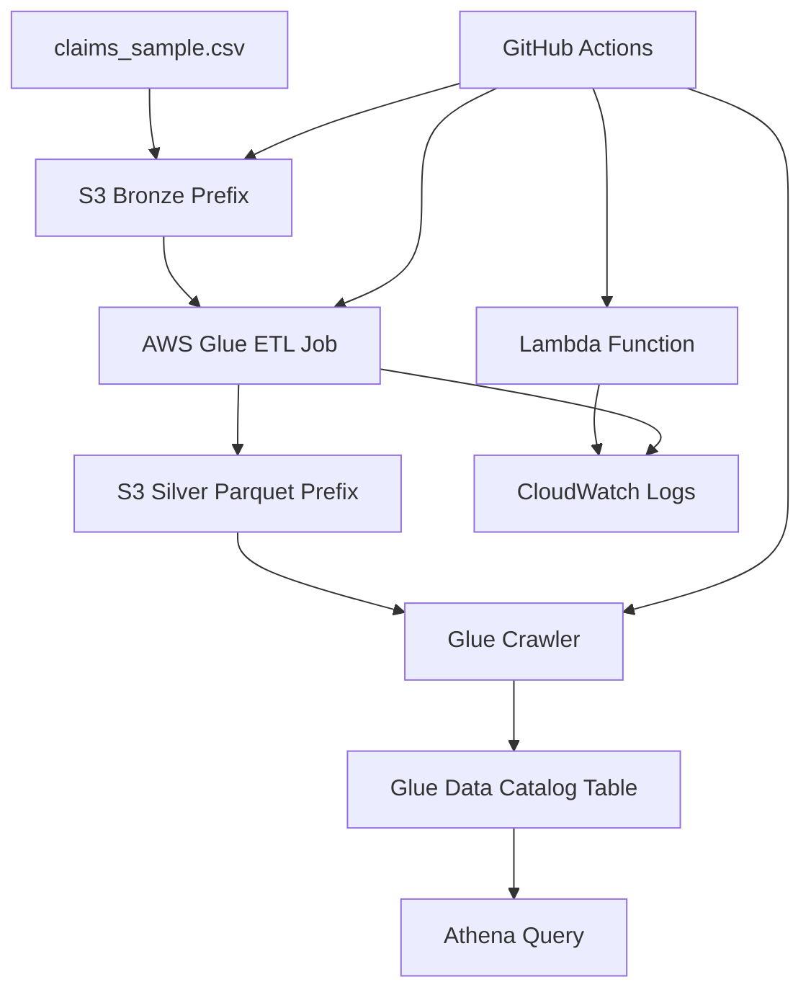

---

## Assumptions

This guide assumes:

* You have an AWS account
* You have a GitHub repository
* You can create IAM roles in AWS
* You have the workflows from this repository
* Your AWS region is `us-east-1`

If you use another region, replace `us-east-1` everywhere.

---

## Naming Convention

Use consistent names. This makes troubleshooting much easier.

Replace `studentname` with your name or initials.

```text
AWS Region: us-east-1
S3 Bucket: studentname-enterprise-data-platform-dev
Glue Database: enterprise_data_platform_dev
Glue Job: claims-transform-dev
Glue Crawler: claims-silver-crawler-dev
Glue Table: claims_silver
Lambda Function: claims-file-validator-dev
```

---

## Step 1: Create Project Folders

Create this structure:

```text
data/
lambda/
glue/jobs/
sql/
docs/
```

Expected final structure:

```text
.
|-- data/
|   `-- claims_sample.csv
|-- lambda/
|   `-- app.py
|-- glue/
|   `-- jobs/
|       `-- claims_transform.py
|-- sql/
|   `-- athena_validation.sql
`-- docs/
    `-- architecture-notes.md
```

---

## Step 2: Add Sample Data

Create `data/claims_sample.csv`.

```csv
claim_id,member_id,provider_id,claim_date,claim_amount,claim_status,diagnosis_code
C1001,M001,P900,2026-01-05,250.75,APPROVED,E119
C1002,M002,P901,2026-01-05,1100.00,DENIED,I10
C1003,M003,P902,2026-01-06,89.25,APPROVED,J459
C1004,M004,P900,2026-01-07,430.10,PENDING,E785
C1005,M001,P903,2026-01-08,760.00,APPROVED,M545
C1005,M001,P903,2026-01-08,760.00,APPROVED,M545
```

The duplicate `C1005` row is intentional. The Glue job should remove it.

---

## Step 3: Add Lambda Code

Create `lambda/app.py`.

```python
import json


def lambda_handler(event, context):
    print("Received event:")
    print(json.dumps(event))

    bucket = event.get("bucket", "not-provided")
    key = event.get("key", "not-provided")

    return {
        "statusCode": 200,
        "body": json.dumps(
            {
                "message": "File validation event received",
                "bucket": bucket,
                "key": key,
            }
        ),
    }
```

### Test Event

Use this Lambda test event:

```json
{
  "bucket": "studentname-enterprise-data-platform-dev",
  "key": "bronze/claims/claims_sample.csv"
}
```

Expected result:

```json
{
  "statusCode": 200,
  "body": "{\"message\": \"File validation event received\", \"bucket\": \"studentname-enterprise-data-platform-dev\", \"key\": \"bronze/claims/claims_sample.csv\"}"
}
```

---

## Step 4: Add Glue ETL Code

Create `glue/jobs/claims_transform.py`.

```python
import sys
from awsglue.context import GlueContext
from awsglue.job import Job
from awsglue.utils import getResolvedOptions
from pyspark.context import SparkContext
from pyspark.sql.functions import col, to_date


args = getResolvedOptions(
    sys.argv,
    [
        "JOB_NAME",
        "INPUT_PATH",
        "OUTPUT_PATH",
    ],
)

sc = SparkContext()
glue_context = GlueContext(sc)
spark = glue_context.spark_session
job = Job(glue_context)
job.init(args["JOB_NAME"], args)

input_path = args["INPUT_PATH"]
output_path = args["OUTPUT_PATH"]

claims_df = (
    spark.read.option("header", "true")
    .option("inferSchema", "true")
    .csv(input_path)
)

curated_df = (
    claims_df.select(
        col("claim_id").cast("string"),
        col("member_id").cast("string"),
        col("provider_id").cast("string"),
        to_date(col("claim_date"), "yyyy-MM-dd").alias("claim_date"),
        col("claim_amount").cast("double"),
        col("claim_status").cast("string"),
        col("diagnosis_code").cast("string"),
    )
    .dropDuplicates(["claim_id"])
)

curated_df.write.mode("overwrite").parquet(output_path)

job.commit()
```

### Glue Job Arguments

After the Glue job is created, add or verify these job parameters:

```text
--INPUT_PATH=s3://studentname-enterprise-data-platform-dev/bronze/claims/
--OUTPUT_PATH=s3://studentname-enterprise-data-platform-dev/silver/claims/
```

The provided workflow accepts `input_path` and `output_path` inputs and passes them to the Glue job as `--INPUT_PATH` and `--OUTPUT_PATH`.

---

## Step 5: Add Athena Validation SQL

Create `sql/athena_validation.sql`.

```sql
SELECT COUNT(*) AS claim_count
FROM enterprise_data_platform_dev.claims_silver;

SELECT claim_status, COUNT(*) AS status_count
FROM enterprise_data_platform_dev.claims_silver
GROUP BY claim_status
ORDER BY claim_status;

SELECT provider_id, SUM(claim_amount) AS total_claim_amount
FROM enterprise_data_platform_dev.claims_silver
GROUP BY provider_id
ORDER BY total_claim_amount DESC;

SELECT *
FROM enterprise_data_platform_dev.claims_silver
ORDER BY claim_id;
```

Expected count:

```text
5
```

The raw file contains 6 rows, but one duplicate claim should be removed.

---

## Step 6: Create GitHub OIDC Role

GitHub Actions should assume an AWS role using OIDC.

### Screen Guide: IAM Roles Overview

Use this image to explain the four roles students need.

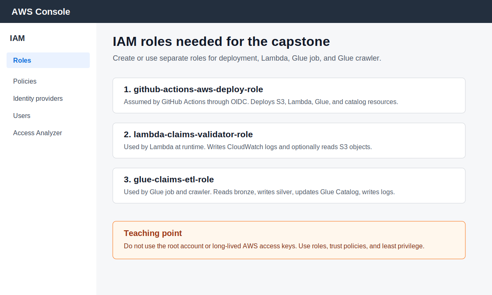

### Screen Guide: Add GitHub OIDC Provider

Use this image to explain how GitHub connects to AWS without access keys.

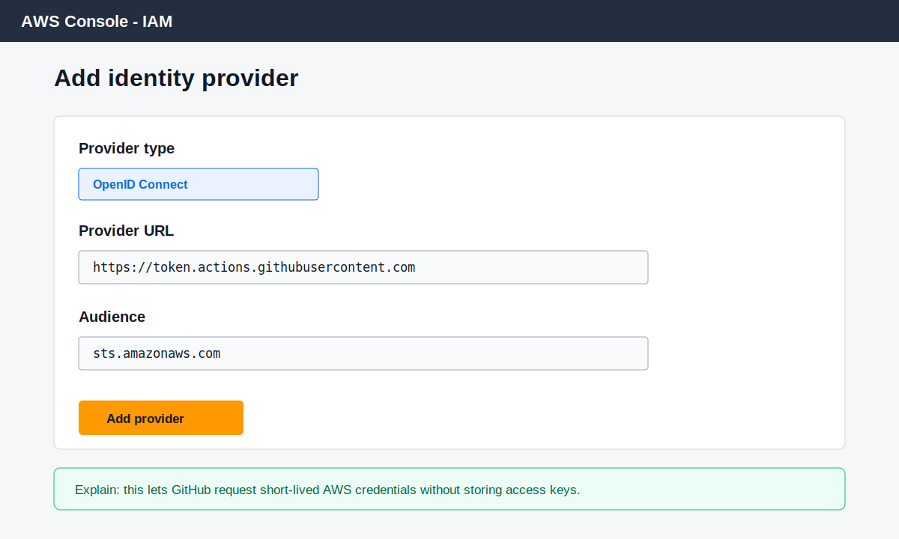

### Trust Policy Example

Replace:

* `123456789012` with your AWS account ID
* `your-github-org` with your GitHub username or organization
* `your-repo-name` with your repository name

```json
{
  "Version": "2012-10-17",
  "Statement": [
    {
      "Effect": "Allow",
      "Principal": {
        "Federated": "arn:aws:iam::123456789012:oidc-provider/token.actions.githubusercontent.com"
      },
      "Action": "sts:AssumeRoleWithWebIdentity",
      "Condition": {
        "StringEquals": {
          "token.actions.githubusercontent.com:aud": "sts.amazonaws.com"
        },
        "StringLike": {
          "token.actions.githubusercontent.com:sub": "repo:your-github-org/your-repo-name:*"
        }
      }
    }
  ]
}
```

### GitHub Repository Variable

In GitHub, go to:

```text
Settings -> Secrets and variables -> Actions -> Variables
```

Create:

```text
AWS_GITHUB_ACTIONS_ROLE_ARN
```

Value:

```text
arn:aws:iam::123456789012:role/github-actions-aws-deploy-role
```

---

## Step 7: Create AWS Execution Roles

You need three types of roles.

### Screen Guide: GitHub Actions Trust Policy

Use this image to explain what a trust policy does.

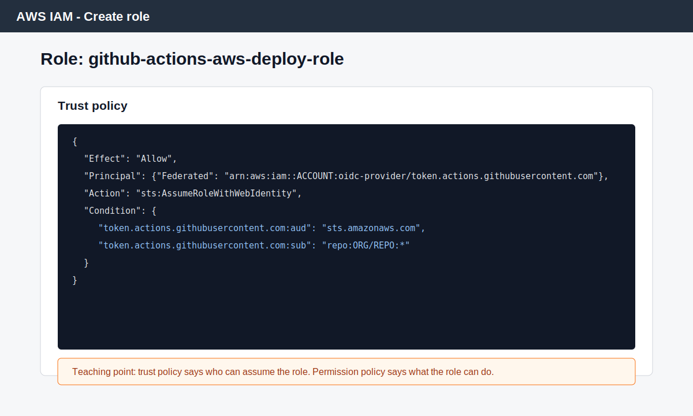

### Screen Guide: GitHub Actions Permission Policy

Use this image to explain least privilege and `iam:PassRole`.

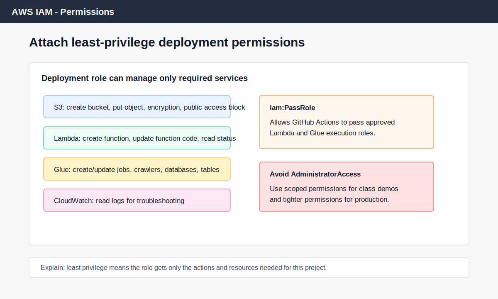

### GitHub Actions Deployment Role

This role is assumed by GitHub Actions.

For a classroom project, it needs permissions for:

* S3 bucket creation and object upload
* Lambda create/update
* Glue create/update
* Glue crawler create/update
* Glue catalog database/table create/update
* `iam:PassRole` for the Lambda and Glue execution roles

### Lambda Execution Role

Trust relationship:

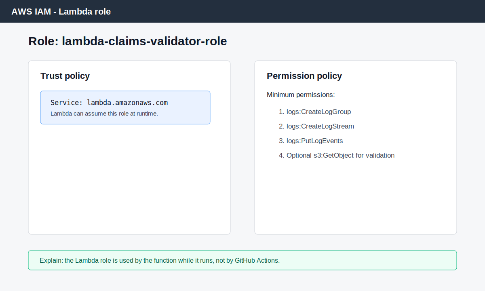

```text
lambda.amazonaws.com
```

Minimum permissions:

* Write logs to CloudWatch
* Read S3 objects if your Lambda validates S3 files

### Glue Job and Crawler Role

Trust relationship:

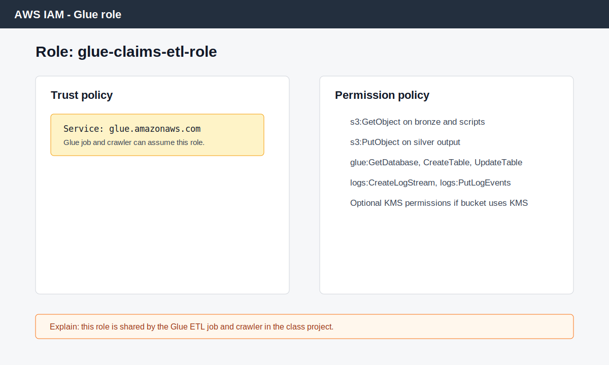

```text
glue.amazonaws.com
```

Minimum permissions:

* Read from bronze S3 prefix
* Write to silver S3 prefix
* Read Glue scripts from S3
* Write CloudWatch logs
* Access Glue Data Catalog

---

## Step 8: Run S3 Workflow

### Screen Guide: GitHub Repository Variable

Use this image to explain where students add the deployment role ARN in GitHub.

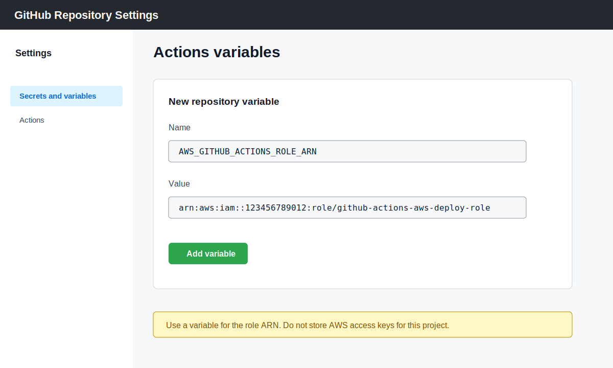

### Screen Guide: Workflow Run Order

Use this image to explain the end-to-end deployment sequence.

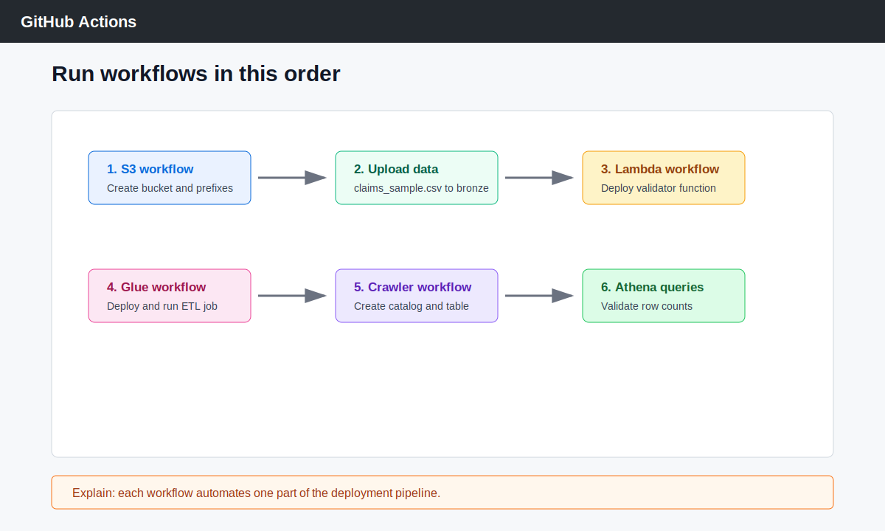

Run:

```text
AWS - Create S3 Bucket and Prefix
```

Run it once for each prefix.

Example first run:

```text
bucket_name = studentname-enterprise-data-platform-dev
aws_region = us-east-1
s3_prefix = bronze/claims/
block_public_access = true
```

Run again with:

```text
silver/claims/
gold/claims_summary/
glue/scripts/
athena/results/
```

Expected result:

* Bucket exists
* Versioning enabled
* Encryption enabled
* Public access blocked
* Prefix objects exist

---

## Step 9: Upload Raw Data

For the first version, upload manually:

```text
S3 -> bucket -> bronze/claims/ -> Upload -> claims_sample.csv
```

Or use AWS CLI:

```bash
aws s3 cp data/claims_sample.csv s3://studentname-enterprise-data-platform-dev/bronze/claims/claims_sample.csv
```

Expected S3 path:

```text
s3://studentname-enterprise-data-platform-dev/bronze/claims/claims_sample.csv
```

---

## Step 10: Deploy Lambda

Run:

```text
AWS - Deploy Lambda From GitHub
```

Inputs:

```text
function_name = claims-file-validator-dev
aws_region = us-east-1
lambda_source_dir = lambda
runtime = python3.12
handler = app.lambda_handler
lambda_role_arn = arn:aws:iam::123456789012:role/lambda-claims-validator-role
```

Validate:

* Open Lambda console
* Find `claims-file-validator-dev`
* Run the test event
* Check CloudWatch Logs

---

## Step 11: Deploy Glue Job

Run:

```text
AWS - Deploy Glue Job From GitHub
```

Inputs:

```text
job_name = claims-transform-dev
aws_region = us-east-1
glue_script_path = glue/jobs/claims_transform.py
script_s3_bucket = studentname-enterprise-data-platform-dev
script_s3_prefix = glue/scripts
input_path = s3://studentname-enterprise-data-platform-dev/bronze/claims/
output_path = s3://studentname-enterprise-data-platform-dev/silver/claims/
glue_role_arn = arn:aws:iam::123456789012:role/glue-claims-etl-role
glue_version = 4.0
worker_type = G.1X
number_of_workers = 2
```

Run the Glue job.

Expected result:

```text
s3://studentname-enterprise-data-platform-dev/silver/claims/
```

contains Parquet files.

---

## Step 12: Create Glue Crawler and Athena Table

Run:

```text
AWS - Create Glue Crawler and Athena Table
```

Inputs:

```text
aws_region = us-east-1
database_name = enterprise_data_platform_dev
table_name = claims_silver
data_s3_location = s3://studentname-enterprise-data-platform-dev/silver/claims/
crawler_name = claims-silver-crawler-dev
crawler_role_arn = arn:aws:iam::123456789012:role/glue-claims-etl-role
create_example_table = true
```

Expected result:

* Glue database exists
* Glue crawler exists
* Glue table exists
* Crawler starts or reports that it is already running

---

## Step 13: Configure Athena Query Result Location

Before running Athena queries, configure the result location:

```text
s3://studentname-enterprise-data-platform-dev/athena/results/
```

In Athena:

```text
Athena -> Workgroup -> Settings -> Query result location
```

If this is not configured, Athena queries may fail.

---

## Step 14: Run Athena Queries

### Screen Guide: Athena Validation

Use this image to explain how students prove the project worked.

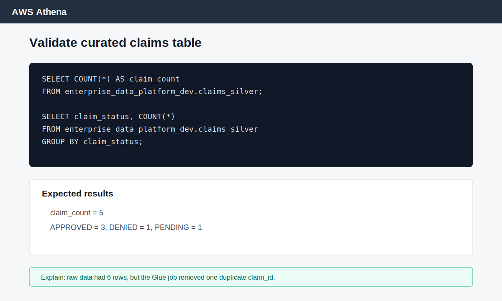

Run:

```sql
SELECT COUNT(*) AS claim_count
FROM enterprise_data_platform_dev.claims_silver;
```

Expected:

```text
5
```

Run:

```sql
SELECT claim_status, COUNT(*) AS status_count
FROM enterprise_data_platform_dev.claims_silver
GROUP BY claim_status
ORDER BY claim_status;
```

Expected concept:

```text
APPROVED = 3
DENIED   = 1
PENDING  = 1
```

Run:

```sql
SELECT provider_id, SUM(claim_amount) AS total_claim_amount
FROM enterprise_data_platform_dev.claims_silver
GROUP BY provider_id
ORDER BY total_claim_amount DESC;
```

---

## Troubleshooting Guide

### Screen Guide: Why Root Credentials Must Not Be Used

Use this image when explaining secure AWS access.

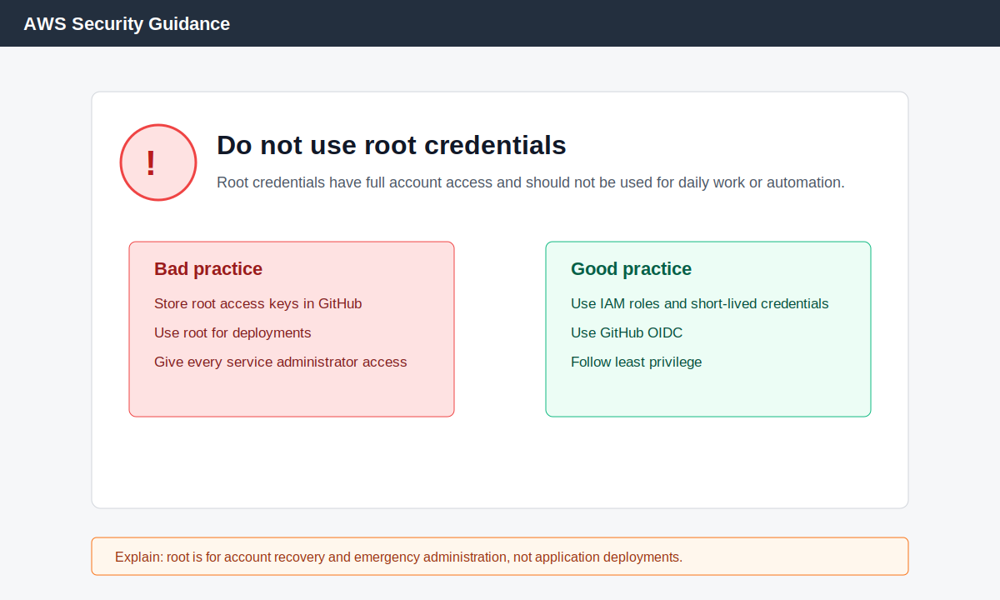

### GitHub Actions Cannot Assume AWS Role

Common error:

```text
Not authorized to perform sts:AssumeRoleWithWebIdentity
```

Check:

* OIDC provider exists in AWS IAM
* Trust policy has correct GitHub org and repo
* `AWS_GITHUB_ACTIONS_ROLE_ARN` variable is correct
* Workflow has `permissions: id-token: write`

### S3 Bucket Creation Fails

Common causes:

* Bucket name is not globally unique
* Region mismatch
* GitHub role lacks S3 permissions
* Public access block permission is missing

Fix:

* Use a more unique bucket name
* Confirm AWS region
* Add required S3 permissions to the deployment role

### Lambda Deployment Fails

Common causes:

* Wrong `lambda_source_dir`
* Wrong handler
* Missing Lambda execution role
* GitHub deployment role lacks `iam:PassRole`

Fix:

* Confirm `lambda/app.py` exists
* Handler should be `app.lambda_handler`
* Confirm Lambda execution role trust policy uses `lambda.amazonaws.com`
* Add `iam:PassRole` for the Lambda execution role

### Glue Job Fails with Missing Arguments

Common error:

```text
GlueArgumentError: the following arguments are required: --INPUT_PATH, --OUTPUT_PATH
```

Fix:

Add job parameters:

```text
--INPUT_PATH=s3://studentname-enterprise-data-platform-dev/bronze/claims/
--OUTPUT_PATH=s3://studentname-enterprise-data-platform-dev/silver/claims/
```

### Glue Job Cannot Read S3

Common error:

```text
AccessDenied
```

Check:

* Glue role has `s3:GetObject` on bronze prefix
* Glue role has `s3:PutObject` on silver prefix
* Bucket policy does not deny the role
* KMS key policy allows the role if using KMS

### Crawler Does Not Create Table

Check:

* The crawler points to `silver/claims/`
* Parquet files exist in that prefix
* Crawler role can read S3
* Crawler role can access Glue Catalog
* Crawler run completed successfully

### Athena Query Fails

Common causes:

* Query result location not configured
* Wrong database name
* Wrong table name
* Table points to empty S3 prefix
* Glue crawler has not run

Fix:

* Configure Athena result location
* Run `SHOW DATABASES;`
* Run `SHOW TABLES IN enterprise_data_platform_dev;`
* Check the table location in Glue Catalog

---

## Final Documentation Template

Students can use this structure for their final submission.

```text
# Enterprise Data Platform Capstone Submission

## Business Problem

Explain the healthcare claims scenario.

## Architecture

Include a diagram and explain each component.

## S3 Design

List bucket and prefixes.

## IAM Design

Explain GitHub Actions role, Lambda role, and Glue role.

## Deployment

Explain each GitHub Actions workflow and include run evidence.

## ETL Logic

Explain how raw claims become curated claims.

## Athena Validation

Include query results.

## Monitoring

Explain CloudWatch logs and Glue run status.

## Troubleshooting

List issues encountered and how they were fixed.

## Production Improvements

Explain what should be improved for a real enterprise.
```

---

## Final Student Explanation

A strong final explanation sounds like this:

```text
I built an AWS data platform for healthcare claims. Raw CSV files land in the bronze S3 prefix. A Glue job reads the raw data, casts columns, removes duplicate claim IDs, and writes curated Parquet data to the silver prefix. A Glue crawler catalogs the silver data so Athena can query it. GitHub Actions deploys S3, Lambda, Glue, and catalog resources using an IAM role through OIDC. Lambda and Glue write logs to CloudWatch. The design follows least privilege, separates raw and curated data, and can be extended with Terraform, KMS, data quality checks, and production monitoring.
```

---

## Completion Checklist

Before submitting, confirm:

* S3 bucket exists
* Bronze, silver, gold, Glue script, and Athena result prefixes exist
* Raw CSV is uploaded to bronze
* Lambda function deploys from GitHub
* Lambda test event succeeds
* Glue script uploads to S3
* Glue job runs successfully
* Silver Parquet files are created
* Glue database exists
* Glue crawler runs successfully
* Glue table exists
* Athena query count returns `5`
* CloudWatch logs are available
* Final documentation is complete

---

## Summary

If a student completes every step in this guide, they will have a working end-to-end AWS data platform project that demonstrates practical knowledge of S3, IAM, Lambda, Glue, Athena, CloudWatch, and GitHub Actions.

---

[Home](../README.md) | [Course Modules](../README.md#course-modules) | [Previous](119-enterprise-data-platform-capstone.md)

