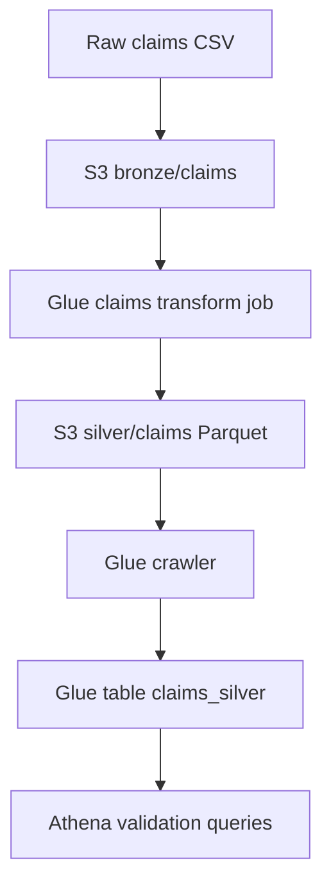

---

[Home](../README.md) | [Course Modules](../README.md#course-modules)

---

# Architecture Notes

## Business Problem

HealthData Corp needs a simple data platform for healthcare claims analytics.

## Data Flow

## Security Notes

* GitHub Actions assumes an AWS role using OIDC.
* Lambda and Glue use execution roles.
* S3 public access should be blocked.
* Glue should receive only the S3 and catalog permissions it needs.

## Operations Notes

* Lambda logs are reviewed in CloudWatch Logs.
* Glue job run details are reviewed in AWS Glue and CloudWatch Logs.
* Athena validates that curated data is queryable.

---

[Home](../README.md) | [Course Modules](../README.md#course-modules)

