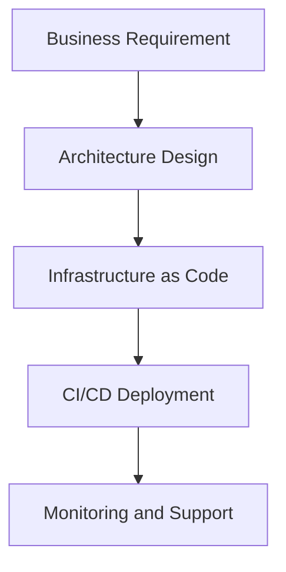

---

[Home](../README.md) | [Course Modules](../README.md#course-modules) | [Previous](84-pull-requests.md) | [Next](86-deploying-glue-jobs.md)

---

# Github Actions

## Module

Module 09 - CI/CD and Deployments

---

## Learning Objectives

By the end of this chapter, students will be able to:

* Explain what Github Actions means in an enterprise AWS environment
* Identify where Github Actions fits in data engineering, DevOps, security, or platform operations
* Describe common real-world use cases and operational risks
* Apply basic best practices in a production-style scenario
* Answer interview questions about Github Actions with clear examples

---

## Why This Topic Matters

Enterprise teams do not use AWS services in isolation.

They use them as part of governed, secure, automated platforms that support applications, data pipelines, analytics, and AI workloads.

Github Actions is important because it affects:

* Security
* Reliability
* Cost
* Compliance
* Deployment speed
* Production support

---

## Teaching Examples

### Example 1: Pull Request Deployment Flow

A developer changes a Glue script and opens a pull request.

A good CI/CD flow runs:

* Code formatting checks
* Unit tests for transformation logic
* Terraform validation if infrastructure changed
* Review and approval before merge
* Automated deployment to DEV, then controlled promotion to PROD

### Example 2: Rollback Discussion

If a deployment breaks a production data pipeline, the team should know whether to roll back code, restore previous infrastructure, replay data, or apply a hotfix.

---

## Core Concepts

### Definition

Github Actions refers to the concepts, services, patterns, and operational practices used to support this part of an enterprise AWS platform.

### Enterprise Context

In a real organization, this topic is usually connected to:

* Account strategy
* IAM and access control
* Networking boundaries
* Monitoring and logging
* Infrastructure as Code
* Change management
* Incident response

### Common Responsibilities

Platform, DevOps, security, and data teams may share responsibility for this topic.

Typical responsibilities include:

* Designing the architecture
* Implementing secure defaults
* Automating deployments
* Monitoring usage and failures
* Troubleshooting production issues
* Documenting operational procedures

---

## Enterprise Scenario

Imagine a healthcare, finance, or retail company running a large data platform on AWS.

The company has:

* Multiple AWS accounts
* DEV, QA, UAT, and PROD environments
* Sensitive customer data
* Data engineering pipelines
* Analytics and AI workloads
* Compliance and audit requirements

In this environment, Github Actions must be designed carefully so teams can move quickly without creating security, reliability, or governance problems.

---

## Architecture Notes

When designing for Github Actions, consider:

* Which AWS accounts are involved
* Which teams need access
* Which services are managed by AWS and which are customer-managed
* How data moves through the platform
* How failures are detected and resolved
* How changes are deployed and reviewed
* How audit evidence is collected

Example enterprise flow:

---

## Best Practices

Use these practices as a starting point:

* Follow least privilege
* Separate non-production and production environments
* Use Infrastructure as Code where possible
* Enable logging and monitoring
* Document ownership and escalation paths
* Review changes before production deployment
* Track cost and usage
* Test failure scenarios before they happen in production

---

## Common Mistakes

Avoid these mistakes:

* Relying on manual console changes without documentation
* Giving overly broad permissions
* Mixing DEV and PROD resources without clear boundaries
* Ignoring monitoring until there is an outage
* Skipping naming standards and tagging
* Treating security as an afterthought

---

## Hands-On Lab

### Lab: Explore Github Actions

Complete the following steps:

1. Review the AWS services or platform components related to Github Actions.
2. Identify which team would own each responsibility.
3. Draw a simple architecture diagram showing how this topic fits into an enterprise AWS platform.
4. List the security controls that should be applied.
5. List the monitoring signals that should be captured.

### Lab Deliverable

Create a short document with:

* Architecture diagram
* Access requirements
* Security controls
* Monitoring approach
* Production support notes

---

## Interview Questions

1. What is Github Actions?
2. Why is Github Actions important in an enterprise AWS environment?
3. Which teams are usually involved with Github Actions?
4. What are common production risks related to Github Actions?
5. How would you secure and monitor Github Actions?

---

## Student Assignment

Design an enterprise-ready approach for Github Actions.

Your answer should include:

* Business use case
* AWS services or platform components involved
* Account and environment strategy
* IAM and security controls
* Deployment approach
* Monitoring and support plan

---

## Summary

Github Actions is part of the larger AWS DevOps and data engineering platform.

To work effectively in enterprise AWS environments, engineers must understand both the technical service details and the operational practices around security, automation, monitoring, governance, and production support.

---

[Home](../README.md) | [Course Modules](../README.md#course-modules) | [Previous](84-pull-requests.md) | [Next](86-deploying-glue-jobs.md)

